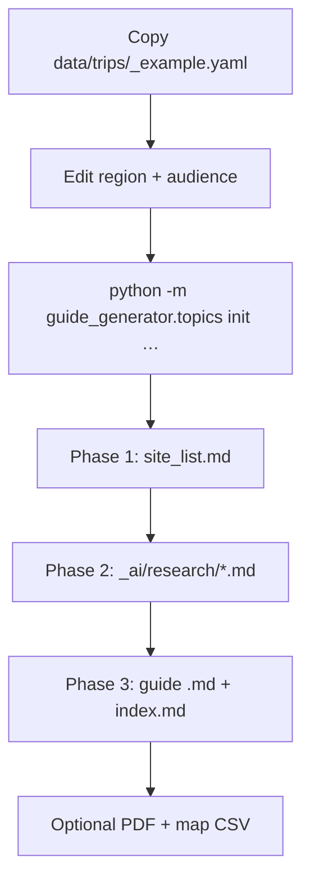

# Getting started with guide-generator

This document is for **people** who want to use this project to build travel guides — including if you have **little or no experience with AI tools**. It explains what you need, how the workflow fits together, what can go wrong, and the limits of what the project (and its authors) promise.

For the full vision see [VISION.md](VISION.md). For day-to-day AI agent instructions see [AI_RUNBOOK.md](AI_RUNBOOK.md).

---

## What this project does

**guide-generator** helps you produce **custom travel guides** for a specific **place** (island, region, national park, …) and **audience** (e.g. landscape photographer, history and culture lover).

Each guide is a folder of Markdown files you can open in [Obsidian](https://obsidian.md/) or any text editor. Optionally you can export:

- **PDF** — printable reference ([PDF.md](PDF.md))
- **CSV map** — import sites into [Google My Maps](https://www.google.com/maps/d/) ([MAPS.md](MAPS.md))

Most of the **research and writing** is meant to be done with an **AI assistant** (for example in [Cursor](https://cursor.com/)) that reads project rules and your topic files. You stay in control: you define the trip, approve the site list, and review the final text before you rely on it in the field.

**What you get from git:** audience definitions, documentation, and Python tools. **Finished guides are not in the repository** — they are created on your machine under `topics/<id>/` and are listed in `.gitignore` so your research stays private unless you choose to share it.

---

## Tools you need

### Required

| Tool | Purpose | How to get it |
|------|---------|---------------|
| **Python 3.10+** | Runs project commands | [python.org](https://www.python.org/downloads/) — on Windows, tick “Add Python to PATH” during install |
| **Git** (recommended) | Clone and update the repository | [git-scm.com](https://git-scm.com/) |
| **Text editor or Obsidian** | Read and edit guide Markdown | Obsidian, VS Code, Cursor, or any editor |
| **AI chat environment** | Research and writing phases | [Cursor](https://cursor.com/) (recommended for this repo), or another agent that can read files and run terminal commands |

### Optional (for exports)

| Tool | Purpose | When needed |
|------|---------|-------------|
| **Pandoc** | Converts guide Markdown to HTML for PDF | `python -m guide_generator.pdf …` — [pandoc.org](https://pandoc.org/installing.html) |
| **Google Chrome or Microsoft Edge** | Renders print-quality PDF from HTML | Same PDF command; Edge is preinstalled on Windows 10+ |
| **Google account** | Import `guide_map.csv` into My Maps | Map export only |

### Python packages (installed from this repo)

```bash
cd guide-generator
pip install -e .
```

For PDF export (optional):

```bash
pip install -e ".[pdf]"
```

For running automated tests (developers):

```bash
pip install -e ".[dev]"
python -m pytest -q
```

### What you do **not** need

- You do **not** need to be a programmer to **use** a guide someone else built.
- You do **not** need LaTeX or a commercial design tool for PDF export.
- You do **not** need to host a server — everything runs on your computer.

---

## First-time setup (about 10 minutes)

1. **Clone or download** the repository to a folder on your computer, e.g. `c:\kod\guide-generator`.

2. **Open a terminal** in that folder:
   - Windows: PowerShell or “Terminal” in VS Code/Cursor (`Ctrl+`` `)
   - macOS/Linux: Terminal

3. **Install the project:**

   ```bash
   pip install -e .
   python --version
   ```

   `python --version` should show 3.10 or higher.

4. **Validate audience definitions** (confirms the project is wired correctly):

   ```bash
   python -m guide_generator.audiences
   ```

   If this prints errors, fix them or ask for help before building a guide.

5. **Set supporting language** (once per installation, if your audiences use it):

   - Copy `data/system.example.yaml` to `data/system.yaml`
   - Edit `supporting_language` (e.g. `name: Polish`, `code: pl`)
   - Check: `python -m guide_generator.system`

   Child audiences state **when** to use this language — for example, a wildlife photographer audience might require bird names in your language alongside scientific names. The guide itself is not fully translated unless an audience says so.

6. **(Optional)** Install [Obsidian](https://obsidian.md/). After you create a guide (see below), you can open `topics/<your_topic_id>/` as a vault or subfolder to read and edit the Markdown notes.

---

## If you have no experience with AI

You do not need to “prompt engineer” from scratch. This repository is designed so an AI agent reads **fixed instructions** in `docs/` and `AGENTS.md` and follows a **three-phase build**. Your job is to **start**, **steer**, and **verify**.

### Minimal concepts

| Term | Meaning here |
|------|----------------|
| **Agent / AI assistant** | A chat that can read your project files and run commands you allow |
| **Topic** | One guide build — a folder `topics/<topic_id>/` you create locally (e.g. `madeira_landscape`) |
| **Audience** | Who the guide is for — defined in `audiences/*.md` |
| **Trip YAML** | Small config file: region + audience — in `data/trips/` |
| **Supporting language** | Your language for extra labels — in `data/system.yaml`; used when an audience asks for it |
| **Phase 1–3** | Discovery → deep research per site → final traveler-facing notes |

### Recommended path for beginners

1. **Install Cursor** (or use another AI IDE that can see your repo).

2. **Open the `guide-generator` folder** as your project/workspace.

3. **Skim the tracked examples** so you know the shape of inputs and scaffolding (not a finished guide):
   - `data/trips/_example.yaml` — copy this to start a new trip config
   - `topics/_template/_ai/research/_TEMPLATE.md` — Phase 2 research note layout
   - `audiences/landscape_photographer.md` — example of a child audience definition

4. **Create your first topic folder** (or ask the AI to do it):

   - Copy `data/trips/_example.yaml` to `data/trips/my_region_landscape.yaml`
   - Edit the copy — set `id`, `region.name`, and `audience`
   - Run:

   ```bash
   python -m guide_generator.topics init data/trips/my_region_landscape.yaml
   ```

   This creates `topics/my_region_landscape/` with `_ai/site_list.md`, `worklog.md`, and an empty `index.md`. That folder is **yours** — it will not appear in git unless you force-add it.

5. **Start a new chat** and say something plain, for example:

   > Build a guide for [region name], audience [audience id].  
   > Follow docs/AI_RUNBOOK.md and docs/GUIDE_BUILD_PROCESS.md.

   Or to continue a guide you already started:

   > Continue work on topic `my_region_landscape`. Read `_ai/worklog.md` and resume the current phase.

6. **Let the agent run Phase 1 first.** It should produce `_ai/site_list.md` — a table of sites to cover. **Read that file.** Remove sites you do not want; add ones you care about. Tell the agent to update the list before it spends time on deep research.

7. **Review as you go.** You are the editor:
   - Phase 2 files live in `_ai/research/` — working notes, can be rough.
   - Phase 3 files are what travelers see — `index.md` and one `<slug>.md` per site; check facts, tone, and safety (access, drones, tides, etc.).

8. **Export when satisfied** (outputs land in your local topic folder):

   ```bash
   python -m guide_generator.pdf my_region_landscape
   python -m guide_generator.maps my_region_landscape
   ```

### Tips if AI feels confusing

- **Be specific about place and audience** — “Madeira, landscape_photographer” beats “make me a guide.”
- **One phase at a time** — “Finish Phase 1 site list only” prevents the agent from skipping planning.
- **Point to files** — “Read `topics/my_topic/_ai/worklog.md` and continue” works better than repeating context.
- **Say no to scripts** — The project rules require the agent to ask before running download or scraping scripts. You can refuse if unsure.
- **Keep your trip YAML** — `data/trips/<id>.yaml` is the contract for region and audience; edit `notes:` to add your preferences.

### What the AI will not do reliably on its own

- Guarantee that opening hours, ferry times, or trail closures are current.
- Replace official park rules, signage, or local law (e.g. drone bans).
- Know your fitness level, weather on your travel dates, or private land boundaries without sources.

**Always cross-check** anything that affects safety, legality, or money before you travel.

---

## Typical workflow (summary)



| Step | You / AI | Main output |
|------|----------|-------------|
| 0 | Create trip YAML + `topics init` | `topics/<id>/` scaffold |
| 1 | Discovery | `_ai/site_list.md` |
| 2 | Deep dive per site | `_ai/research/<slug>.md` |
| 3 | Compile for travelers | `index.md`, `<slug>.md` |
| 4 | Export (optional) | `guide.pdf`, `guide_map.csv` |

Detailed phase rules: [GUIDE_BUILD_PROCESS.md](GUIDE_BUILD_PROCESS.md).  
Human-oriented workflow: [GUIDE_WORKFLOW.md](GUIDE_WORKFLOW.md).

### Important folders

| Path | Role |
|------|------|
| `audiences/` | Who guides are written for (editable definitions) |
| `data/trips/` | Your trip configs (usually **not** committed to git) |
| `data/system.yaml` | Supporting language for this installation (local; copy from `system.example.yaml`) |
| `topics/<id>/` | One guide’s content and research (usually **local only**) |
| `docs/` | How to build guides and use exports |
| `src/guide_generator/` | Python helpers (init, PDF, maps, audience resolver) |

Guide output and personal trip files are typically in `.gitignore` — your guides stay on your machine unless you choose to share them.

---

## Risks and consequences of using this project

Using AI-assisted research for travel has real-world effects. Understand these before you rely on a guide in the field.

### Accuracy and completeness

- **Facts can be wrong or outdated** — even when sources are cited, links break, museums change hours, and archaeology labels get updated.
- **Coverage is selective** — Phase 1 chooses sites; important places can be missed unless you add them.
- **Coordinates may be approximate** — especially for clusters, linear features, or “representative” map points in `_ai/map_coords.yaml`. GPS and official trailheads beat CSV pins.
- **AI can misread sources** — summaries may soften nuance (e.g. access restrictions, seasonal closures).

**Consequence:** Wrong or incomplete information can waste time, close doors, or send you to the wrong place. It rarely replaces checking official sites close to your trip date.

### Safety and legal

- Guides may mention **cliffs, tides, military areas, drone rules, or fragile habitats**. Rules change; enforcement varies.
- **Heritage sites** may have protected status — climbing, metal detecting, or removing material can be illegal.
- **Private land** and **livestock** boundaries are not always obvious on maps.

**Consequence:** You are responsible for your own safety and for complying with local law and landowner rules. Do not treat generated text as permission to enter or photograph somewhere.

### Copyright and images

- Phase 2 may download **Creative Commons** images when the audience requires it; attribution belongs in `attachments/images/ATTRIBUTION.md`.
- Not every image suggestion is licensed for your use; verify license before publishing a PDF commercially.

**Consequence:** Misuse of images or long excerpts can create copyright issues if you redistribute the guide.

### Cost, privacy, and AI services

- Building a guide uses **AI provider tokens** (paid or subscription depending on your tool).
- Sending region names, trip dates, or notes to a cloud AI may be subject to that provider’s privacy policy.
- Pasting **secrets** (API keys, personal addresses) into chat is unsafe.

**Consequence:** Financial cost and potential leakage of information you type into the AI chat.

### Automation scripts

- The project may suggest **download or analysis scripts**. They run on your machine with your permissions.

**Consequence:** Only approve scripts you understand; malicious or buggy automation can affect files on your computer.

### Travel decisions

- A guide is **information**, not a booking service, tour operator, or emergency service.

**Consequence:** Ferry cancellations, medical issues, or weather still require real-world planning and local services.

---

## Disclaimer — no responsibility of the author

**READ CAREFULLY.**

The **guide-generator** project, its **source code**, **documentation**, and any **guides or exports** produced with it are provided **“as is”**, without warranty of any kind, express or implied, including but not limited to warranties of merchantability, fitness for a particular purpose, accuracy, completeness, or non-infringement.

**The authors, contributors, and maintainers of this project:**

- Do **not** guarantee that any guide content is correct, current, safe, or suitable for your trip.
- Do **not** provide travel advice, professional guiding, legal advice, or emergency assistance.
- Are **not** responsible for any loss, injury, damage, legal claim, or other harm arising from your use of the software, AI-generated content, exported PDFs, map files, or reliance on coordinates, descriptions, or suggestions in a guide — whether such harm is direct, indirect, incidental, or consequential.
- Are **not** liable for content produced by third-party AI services, websites, or tools you connect to this workflow.

**You alone** are responsible for:

- Verifying information before and during travel  
- Obeying laws, park rules, and land access restrictions  
- Your safety and the safety of others  
- How you publish, share, or commercialize any guide you build  

If you do not accept these terms, **do not use** this project or any guides generated with it.

---

## Where to go next

| Goal | Document / path |
|------|-----------------|
| Build your first guide with an AI agent | [AI_RUNBOOK.md](AI_RUNBOOK.md) + [GUIDE_BUILD_PROCESS.md](GUIDE_BUILD_PROCESS.md) |
| Understand audiences | [APPROACH.md](APPROACH.md) |
| Obsidian formatting | [OBSIDIAN.md](OBSIDIAN.md) |
| PDF export | [PDF.md](PDF.md) |
| Google My Maps CSV | [MAPS.md](MAPS.md) |
| Example trip config (in repo) | `data/trips/_example.yaml` |
| Topic scaffold (in repo) | `topics/_template/` — research template only |
| Your finished guide (local, not in git) | `topics/<topic_id>/` after `topics init` and Phases 1–3 |

**Quick commands (from repo root):**

```bash
pip install -e .
python -m guide_generator.audiences
python -m guide_generator.system
python -m guide_generator.topics init data/trips/<your_trip>.yaml
python -m guide_generator.pdf <topic_id>
python -m guide_generator.maps <topic_id>
```
