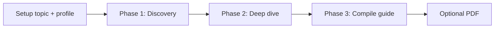

# Guide build process

General, **audience-agnostic** process for building a topic guide. Every audience inherits this via root technical requirements. Audience-specific rules (what to include per site, media, tone) come from the resolved `audience_profile.md`.

See also: [GUIDE_WORKFLOW.md](GUIDE_WORKFLOW.md), [AI_RUNBOOK.md](AI_RUNBOOK.md).

---

## Overview



| Phase | Goal | Primary outputs |
|-------|------|-----------------|
| **1 — Discovery** | Understand the region; define **what** to cover | `_ai/site_list.md`, Phase 1 notes in `worklog.md` |
| **2 — Deep dive** | Research **each** site or subject in depth | `_ai/research/<site-slug>.md` per entry, worklog sources |
| **3 — Compile** | Write traveler-facing guide | `index.md`, topic `*.md`, `attachments/` if needed |

Do **not** skip Phase 1 to write polished guide pages. Do **not** publish Phase 2 research notes as final guide text without Phase 3 editing.

---

## Phase 0 — Setup (once per topic)

1. **System language (once per installation):** copy `data/system.example.yaml` → `data/system.yaml` and set `supporting_language` if any audience you use references it.
2. Trip YAML in `data/trips/<topic_id>.yaml`
3. `python -m guide_generator.topics init data/trips/<topic_id>.yaml`
4. Read `topics/<topic_id>/_ai/audience_profile.md` (includes **System context**) and `input.yaml`

---

## Phase 1 — Discovery (initial general research)

### Purpose

Build a **scoped plan**: which sites, subjects, or areas merit coverage for this region and audience — before detailed work on any single place.

### Inputs

- `topics/<topic_id>/_ai/input.yaml` — geographic constraint (`region.name`, type, country)
- `topics/<topic_id>/_ai/audience_profile.md` — what the guide must deliver
- **Websites for search** listed in the audience profile (see below) — **starting points only**
- General web search, maps, official park/tourism pages, encyclopedic sources

### Websites for search (audience-defined)

Audiences may list trusted or high-yield URLs under a **Websites for search** block (in `## Content requirements` or `## Additions`):

```markdown
### Websites for search

- https://example.com/official-park-page
- https://example.com/photo-community
```

**Phase 1 must consult these URLs.** Phase 2 and later research **may and should** use additional sources discovered along the way.

### Activities

1. Broad research on the region: geography, sub-areas, access context, what exists within scope.
2. Cross-check with audience requirements (e.g. hidden gems vs landmarks — audience-specific).
3. Draft a **candidate list** of sites/subjects; merge overlaps; drop out-of-scope items.
4. For each candidate: one-line **why include**, preliminary **source**, optional **priority** (must / should / optional).
5. Log all sources in `worklog.md` under **Phase 1**.

### Outputs

**`topics/<topic_id>/_ai/site_list.md`** (required):

```markdown
# Site list: <topic_id>

Status: draft | approved

| # | Site / subject | Slug | Priority | Why include | Phase 2 |
|---|----------------|------|----------|-------------|---------|
| 1 | Example Cliff | example-cliff | must | … | pending |
```

**`topics/<topic_id>/_ai/worklog.md`** — section `## Phase 1 — Discovery` with summary and source table.

**Optional:** stub `index.md` with region intro only (no per-site detail yet).

### Phase 1 done when

- `site_list.md` has a stable set of entries aligned with region + audience.
- User may review and approve (set `Status: approved` in site list) before Phase 2 at scale.

---

## Phase 2 — Deep dive (per site / subject)

### Purpose

For **each row** in `site_list.md`, gather everything needed to write an accurate, useful entry — per audience rules (e.g. access, photographers, images, field data).

### Inputs

- One site/subject from `site_list.md`
- Audience profile (per-site checklist from audience additions)
- Phase 1 sources plus **new** sources found during deep dive (not limited to Websites for search)

### Activities (repeat per site)

1. Mark site `in progress` in `site_list.md`.
2. Targeted research: official pages, maps, portfolios, **specific photographs** (not only category pages), access rules, etc.
3. Record findings in **`topics/<topic_id>/_ai/research/<slug>.md`** — use the template below (all sections required unless audience says otherwise).
4. Satisfy audience-specific requirements (reference photographers, **reference images with URLs + licenses**, coordinates from sources).
5. **Images (when audience requires them — e.g. `landscape_photographer`):**
   - Search Wikimedia Commons, tourism boards, and photographer portfolios for **this site**.
   - List each image in the research file (author, URL, license).
   - **Download** CC / public-domain images to `topics/<topic_id>/attachments/images/<slug>/` and note local filename in research file.
   - Link-only (no download) for all-rights-reserved or unclear license — still list URL + attribution for Phase 3.
   - Maintain `attachments/images/ATTRIBUTION.md` (running manifest).
6. Mark site `done` in `site_list.md`; append sources to worklog **Phase 2** table.

### Image minimums (landscape_photographer and similar)

| Site priority | Specific image URLs in research | Download to attachments (CC/PD only) |
|---------------|--------------------------------|-------------------------------------|
| **must** | ≥ 2 per site | ≥ 1 per site when CC/PD available |
| **should** | ≥ 1 per site | optional; prefer 1 CC/PD when available |
| **optional** | ≥ 1 if included in guide | optional |

Do **not** substitute Wikimedia **category** links for specific file URLs.

### `_ai/research/<slug>.md` template

```markdown
# Research: <Site name>

## Sources consulted
- …

## Facts (sourced)
- Coordinates: …
- Access: …

## Reference photographers
| Photographer | Why interesting | Link |
|--------------|-----------------|------|

## Reference images
| File / description | Author | License | Source URL | Local path |
|--------------------|--------|---------|------------|------------|
| … | … | CC BY-SA 4.0 | https://commons.wikimedia.org/wiki/File:… | attachments/images/<slug>/… |

## Open questions
- …

## Draft bullets for guide
- …
```

### Phase 2 done when

- Every site in `site_list.md` is `done` (or explicitly `deferred` with reason in worklog).
- For image-requiring audiences: image minimums met; `ATTRIBUTION.md` updated.

---

## Phase 3 — Compile (final guide)

### Purpose

Turn Phase 2 research into **traveler-facing** Obsidian notes — clear structure, consistent tone, wikilinks, no internal agent shorthand.

### Activities

1. Create or update one note per site (or logical groups) under `topics/<topic_id>/`.
2. Update `index.md` **Contents** with `[[wikilinks]]` to all guide notes.
3. Embed or link images from Phase 2 research (`attachments/images/` or attributed URLs); do not skip images that were found and licensed in Phase 2.
4. Remove duplication; ensure every factual claim is source-backed (detail in guide, full trail in worklog).
5. Log **Phase 3** summary in `worklog.md`.

### Phase 3 done when

- `index.md` links all intended content.
- Guide matches audience profile and geographic scope.
- Ready for optional PDF export ([PDF.md](PDF.md)) and My Maps CSV ([MAPS.md](MAPS.md)).

---

## Optional — Google My Maps CSV

After Phase 3:

```bash
python -m guide_generator.maps <topic_id>
```

Writes `topics/<topic_id>/guide_map.csv` — single file with Name, Description, Latitude, Longitude, and **Layer** column for icon grouping in [Google My Maps](https://www.google.com/maps/d/). See [MAPS.md](MAPS.md).

## Worklog structure (all phases)

`topics/<topic_id>/_ai/worklog.md` should contain:

```markdown
## Phase 1 — Discovery
…

## Phase 2 — Deep dive
…

## Phase 3 — Compile
…

## Sources
| Date | Source | Phase | Used for |
```

---

## Session discipline

- At session start: read `worklog.md` + `site_list.md` → know **current phase** and **next site**.
- At session end: update status columns and worklog.
- One focused session can cover one phase or one site in Phase 2 — avoid mixing Phase 1 discovery with Phase 3 polish.
