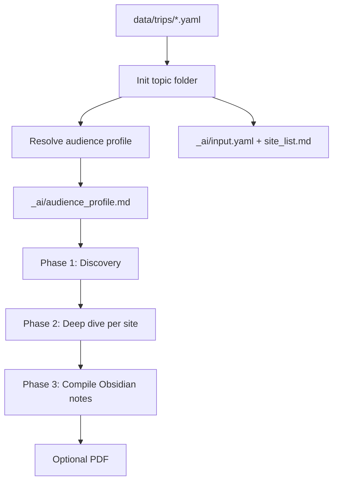

# Guide generation workflow

> **New to the project?** Start with **[GETTING_STARTED.md](GETTING_STARTED.md)**.  
> **AI agents:** operational steps and CLI commands are in **[AI_RUNBOOK.md](AI_RUNBOOK.md)**.

A **topic** is one guide build: a **geographic scope** combined with one **audience**.

Examples:

| Region input | Audience | Topic intent |
|--------------|----------|--------------|
| Öland island | `landscape_photographer` | Landscape photo guide for Öland |
| Madeira | `landscape_photographer` | … |
| Pomerania region, Poland | `history_culture_lover` | … |
| Słowiński National Park | `landscape_photographer` | … |

The pair `(region, audience)` determines **what** to research and **how** to present it.

## Pipeline

Setup → **three-phase build** ([GUIDE_BUILD_PROCESS.md](GUIDE_BUILD_PROCESS.md)) → optional PDF.



### Step 1 — Topic folder

Each guide lives under `topics/<topic_id>/`:

```
topics/<topic_id>/
├── index.md
├── …                     # Guide notes (Phase 3)
├── _ai/
│   ├── input.yaml
│   ├── audience_profile.md
│   ├── site_list.md      # Phase 1 output — sites to cover
│   ├── worklog.md        # Phase 1 / 2 / 3 log + sources
│   └── research/         # Phase 2 working notes per site
└── attachments/
```

Create with: `python -m guide_generator.topics init data/trips/<trip_id>.yaml`

If the topic folder **already exists**, do not run `init` again — continue work in that folder.  
After **audience definition** changes: `python -m guide_generator.topics refresh-profile <topic_id>`.

`<topic_id>` matches the `id` field in the trip YAML (filename stem).

### Step 2 — Flat audience profile

Before research, resolve the audience graph into a single file:

`topics/<topic_id>/_ai/audience_profile.md`

This is the **only** audience reference during content work. It includes merged sections and metadata (resolved at, source audience id, parent chain).

Cached copy (optional): `python -m guide_generator.audiences resolve <audience_id>` → `data/cache/audiences/<audience_id>.md`

### Step 3 — Build phases

Follow **[GUIDE_BUILD_PROCESS.md](GUIDE_BUILD_PROCESS.md)**:

1. **Discovery** — general research, audience **Websites for search**, define `site_list.md`
2. **Deep dive** — one `_ai/research/<slug>.md` per site; additional sources OK
3. **Compile** — traveler-facing Obsidian notes + `index.md`

### Step 4 — Content (Obsidian Markdown)

- Multiple `.md` files; split by logical sections (overview, locations, practical, etc.).
- Use Obsidian conventions — see [OBSIDIAN.md](OBSIDIAN.md).
- Link notes with `[[wikilinks]]`; embed media from `attachments/`.
- Traveler-facing text only in topic `.md` files (not in `_ai/`).

Research rules (all phases): see [GUIDE_BUILD_PROCESS.md](GUIDE_BUILD_PROCESS.md) and [GUIDE_WORKFLOW.md](GUIDE_WORKFLOW.md#research-discipline).

Allowed sources and actions:

| Action | Allowed |
|--------|---------|
| General knowledge | Yes |
| Internet research for region + audience topics | Yes |
| URLs under audience **Websites for search** (Phase 1 priority) | Yes |
| Additional URLs found in Phase 2+ | Yes |
| Download images / audio | Only if audience or content rules require it |
| Create/run download or analysis scripts | Only with **explicit human permission** |

All processing for a guide happens **inside** `topics/<topic_id>/`.

### Step 5 — PDF (on request)

Compile from topic Markdown into a styled PDF. See [PDF.md](PDF.md).

Command (when implemented): `python -m guide_generator.pdf topics/<topic_id>/`

## Research discipline

### Must do

- Cite or record sources in `_ai/worklog.md` (URLs, datasets, dates accessed).
- Take factual data (coordinates, opening hours, distances) **from sources** — never guess.
- Stay within the geographic scope and audience requirements.

### Must not do

- **No assumption-based calculations** (e.g. inventing GPS coordinates, sunrise times without a source).
- **No scope creep** — do not add unrelated sections unless there is a **high chance** the audience would significantly benefit; log the rationale in the worklog if you do.

## Geographic input

Trip files in `data/trips/<id>.yaml`:

```yaml
id: madeira_landscape
region:
  name: Madeira
  type: island    # island | region | national_park | city | area | ...
  country: Portugal
  # Optional, source-backed only when filled:
  # bounds: ...
  # center: ...
audience: landscape_photographer
dates:
  start: null
  end: null
notes: []
```

`region.name` is the primary geographic constraint for research.

## Worklogs

| Scope | Location |
|-------|----------|
| System development | `_ai/buildlog.md` (repo root) |
| One guide / topic | `topics/<topic_id>/_ai/worklog.md` |

## Agent checklist (per guide task)

1. Read `input.yaml`, `audience_profile.md`, `worklog.md`, `site_list.md`.
2. Identify **current phase** ([GUIDE_BUILD_PROCESS.md](GUIDE_BUILD_PROCESS.md)).
3. Execute phase work; update `site_list.md` / `_ai/research/` as needed.
4. Phase 3 only: write traveler `.md` notes and `index.md` links.
5. Log sources by phase in `worklog.md`.
6. Ask permission before scripts; downloads per audience rules.
7. PDF on request after Phase 3 complete.
